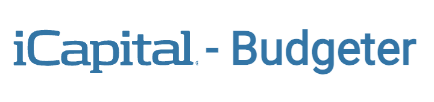

# 

[](https://icapital-budgeter.netlify.app/)

## Description

The iCapital Budgeter Frontend is part of the Software Engineer Take-Home Exam Project, designed to evaluate fellows' analytical, software development, and problem-solving skills by assessing their ability to design and develop a full-stack application. This project aims to provide insight into the candidate's thought processes, research methods, and approach to solving problems.

The application allows users to track income and expenses by means of logging financial transactions. Among others, using fields such as transaction type and category, users can track three accounts: checking, savings, and investments, as functions of these financial transactions. The application also allows users to view real-time stock prices and analyze stock performance, helping them make more informed investment decisions. The data for the three accounts is graphed in order for users to see trends in their spending and savings patterns.

See [backend repository](https://github.com/jorammercado/icapital-budgeter-backend/blob/main/README.md) for full security features and backend services.

## Contents
- [Tech Stack](#tech-stack)
- [Features](#features)
- [Guest Login](#guest-login)
- [Pages](#pages)
- [Deployed Application](#deployed-application)
- [GitHub Repositories](#github-repositories)
- [Getting Started](#getting-started)
- [License](#license)
- [Contact](#contact)


## Tech Stack

- **Frontend**: React, SCSS (BEM), D3, Bootstrap, styled-components
- **Backend**: Node.js, Express
- **Database**: PostgreSQL
- **Third Party API**: Polygon.io for real-time stock data
- **Authentication**: JWT (using jwt-decode for session management & security)


## Features

- **Transaction Table**: Users can view their income, expenses, and investment transactions in an interactive table format. The table includes sorting capabilities for different transaction attributes such as type, amount, category, and date.

- **Graphs for Transactions**: Line graphs are implemented using D3.js to provide a visual representation of how users' checking, saving and investment accounts change over time as a function of individual transactions, helping users make better, more informed decisions. Users can select which accounts to view and can zoom in/out on a given transactions group.

- **Stock Price Data Integration**: Real-time stock price data is fetched from Polygon.io API. Users can view the latest data for multiple stocks in a tabular format, including metrics such as open, close, high, low, and volume. This feature provides an overview of the stock market and helps users understand the status of their investments.

- **Multi-Factor Authentication (MFA)**: MFA is implemented to add an extra layer of security for user authentication, ensuring only authorized users can access their accounts. 

- **Session Security**: Session management on the frontend is implemented using a JWT (JSON Web Token) issued by the backend after verifying user credentials. The JWT is securely stored in local storage with an expiration time of 30 minutes. Upon expiration or user logout, the token and general login data are automatically removed from local storage to maintain session security. Sensitive user data, such as financial transactions, is not stored on the frontend. Instead, it is retrieved from the backend after verifying the token in the request header.

## Guest Login

The application includes a **Guest Login** feature, allowing visitors to explore the full functionality of the site without creating an account. This feature provides a seamless way to navigate the platform and interact with all features using pre-seeded "dummy" data. It is ideal for demonstrating the application’s capabilities while ensuring the integrity of real user data.


## Pages

- **Home**: Provides an overview of the application, welcoming users and highlighting key features.
- **Login**: Allows users to log in using their credentials to access their accounts securely.
- **Sign-Up**: Enables new users to create an account by providing necessary details.
- **Verify OTP**: Used during the login process to verify the one-time passcode sent to the user.
- **404**: Displays an error message when users attempt to navigate to a non-existent page.
- **Account Details**: Shows detailed information about the user’s account.
- **Edit Account Details**: Allows users to update their account information.
- **Edit Account Password**: Enables users to change their account password securely.
- **Dashboard**: Displays account balances for checking, savings, and investments in a consolidated view.
- **Investments**: Provides real time stock prices from third party API polygon.io.
- **Transactions**: Allows users to view transactions in both table and graph formats, including sorting and filtering options.
- **Add Transaction**: Enables users to log new financial transactions with details such as type, amount, and category.


## Deployed Application
- **Frontend hosted on Netlify**: [https://icapital-budgeter.netlify.app/](https://icapital-budgeter.netlify.app/)
- **Backend Server hosted on Render**: [https://icapital-budgeter-backend-services.onrender.com/](https://icapital-budgeter-backend-services.onrender.com/)

## GitHub Repositories
- **Frontend**: [https://github.com/jorammercado/icapital-budgeter-frontend](https://github.com/jorammercado/icapital-budgeter-frontend)
- **Backend**:  [https://github.com/jorammercado/icapital-budgeter-backend](https://github.com/jorammercado/icapital-budgeter-backend)

## Getting Started

### Prerequisites

To run this project, you will need:

- Node.js (version 14 or above)
- npm or yarn for package management

### Installation

1. Fork the repository from [https://github.com/jorammercado/icapital-budgeter-frontend](https://github.com/jorammercado/icapital-budgeter-frontend).

2. Then clone such repository:
   ```bash
   git clone https://github.com/your-username/icapital-budgeter-frontend.git
   ```
3. Navigate to the project directory:
   ```bash
   cd icapital-budgeter-frontend
   ```
4. Create a `.env` file in the root of the project directory with the following content (replace `4001` with the port your backend server is running on if different). To get a Polygon API key you can go to https://polygon.io/ and click [Create API Key](https://polygon.io/dashboard/signup?redirect=%2Fdashboard%2Fkeys):
   ```
   VITE_API_URL=http://localhost:4001
   VITE_POLYGON_API_KEY=your_polygon_api_key_here
   ``` 
5. Install dependencies:
   ```bash
   npm install
   ```

### Running the Application

To start the development application:

```bash
npm run dev
```

This will run the frontend services.

## License
This project is licensed under the MIT License. See the [LICENSE](https://opensource.org/license/mit) file for details.

## Contact
For any inquiries or feedback, please contact:

- Joram Mercado: [GitHub](https://github.com/jorammercado), [LinkedIn](https://www.linkedin.com/in/jorammercado)
