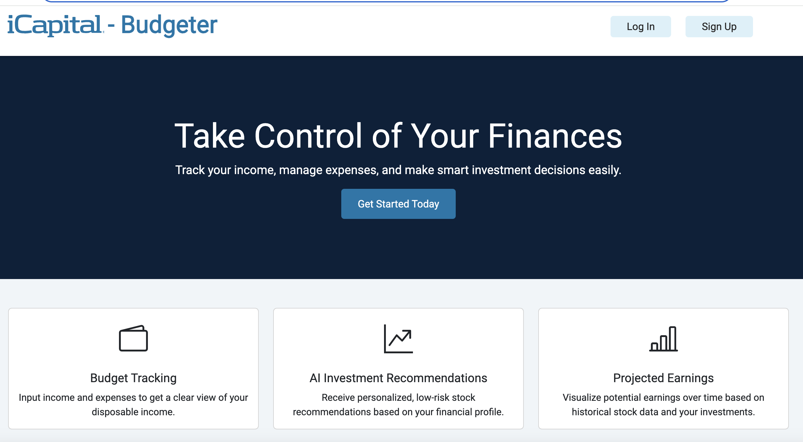

# Financial Insights and Tracking Application
___

[](https://fintrackpro.netlify.app/)

## Description
The FinTrack application allows users to track income and expenses by logging financial transactions. Users can categorize and log transactions to track their checking, savings, and investment accounts. The data for the three accounts is tabulated and graphed, with sorting and filtering features in order for users to easily find transactions and see trends in their spending and savings patterns. The application also allows users to view real-time stock prices to analyze stock performance, as well as having relevant and current financial news, helping users make confident and informed investment decisions. 

## Contents
- [Tech Stack](#tech-stack)
- [Deployed Application](#deployed-application)
- [GitHub Repositories](#github-repositories)
- [Guest Login](#guest-login)
- [Pages](#pages)
- [Features](#features)
   - [A. Session Security](#a-session-security)
      - [Route Access Control](#route-access-control)
      - [Example Scenarios](#example-scenarios)
      - [Dynamic Navigation Bar](#dynamic-navigation-bar)
      - [Backend Access](#backend-access)
      - [Session Timeout Management](#session-timeout-management)
         - [User Login and Session Initialization](#user-login-and-session-initialization)
         - [Determining User Login Status](#determining-user-login-status)
         - [User Logout and Timeout Cleanup](#user-logout-and-timeout-cleanup)
   - [B. Transaction Management](#b-transaction-management)
      - [Transactions Table](#transactions-table)
         - [General Attributes](#general-attributes)
         - [Table Styling](#table-styling)
         - [Sorting Functionality](#sorting-functionality)
         - [Adding Transactions](#adding-transactions)
         - [Editing & Deleting Transactions](#editing--deleting-transactions)
         - [Balance Updates](#balance-updates)
      - [Transactions Graph](#transactions-graph)
         - [How the Transactions Graph was Built](#how-the-transactions-graph-was-built)
         - [Core Functionalities](#core-functionalities)
         - [Axes & Visualization](#axes--visualizationh)
         - [Dynamic Scaling](#dynamic-scaling)
         - [User Interaction Features](#user-interaction-features)
            - [Legend and Toggling](#legend-and-toggling)
            - [Brushing for Selection](#brushing-for-selection)
         - [Why This Graph Matters](#why-this-graph-matters)
   - [C. Multi-Factor Authentication](#c-multi-factor-authentication-mfa)
      - [Login Initiation](#login-initiation)
         - [Validation](#validations)
         - [Submitting Request](#submits-request)
      - [Backend receives initial login request](#backend-receives-initial-login-request)
         - [Verifies the provided email and password](#verifies-the-provided-email-and-password)
         - [Generates a 6-digit OTP](#generates-a-6-digit-otp)
         - [Sends the OTP to the user’s email](#sends-the-otp-to-the-users-email)
         - [Sends a response to the frontend](#sends-a-response-to-the-frontend)
      - [Frontend redirect from Login to VerifyOTP Page](#frontend-redirect-from-login-to-verifyotp-page)
         - [Validation](#validation)
         - [Submitting Request](#submitting-request)
      - [Backend Receives OTP for Verification](#backend-receives-otp-for-verification)
   - [D. Pagination](#d-pagination)
      - [Pagination Logic](#pagination-logic-usepaginationjs)
      - [Pagination Component](#pagination-component-paginationjsx)
      - [Pagination in Use: Transactions List](#pagination-in-use-transactions-list)
   - [E. Stock Price Data Integration](#e-stock-price-data-integration)
   - [F. Market News](#f-market-news)
- [Getting Started](#getting-started)
- [License](#license)
- [Contact](#contact)

## Tech Stack
- **Frontend**: React, SCSS (BEM), D3, Bootstrap, styled-components
- **Backend**: Node.js, Express
- **Database**: PostgreSQL
- **APIs**: Polygon.io for real-time stock data, Finnhub.io for market news
- **Authentication**: JWT, bcrypt (bcrypt for password verification; JWT for starting sessions and securing protected routes, handled by the backend)
- **Session Management**: JWT (session lifecycle managed using jwt-decode)

## Deployed Application
- **Frontend hosted on Netlify**: [fintrackpro.netlify.app](https://fintrackpro.netlify.app/)
- **Backend Server hosted on Render**: [fintrack-backend-services.onrender.com](https://fintrack-backend-services.onrender.com/)

## GitHub Repositories
- **Frontend**: [github.com/JoramAMercado/fin-track-frontend](https://github.com/JoramAMercado/fin-track-frontend)
- **Backend**:  [github.com/JoramAMercado/fin-track-backend](https://github.com/JoramAMercado/fin-track-backend)

## Guest Login
The application includes a **Guest Login** feature, allowing visitors to explore the full functionality of the site without creating an account. This feature provides a seamless way to navigate the platform and interact with all features using preloaded sample data. It is ideal for demonstrating the application’s capabilities while ensuring the integrity of real user data.

## Pages
- **Home**: Provides an overview of the application, welcoming users and highlighting key features.
- **Login**: Allows users to log in using their credentials to access their accounts securely.
- **Sign Up**: Enables new users to create an account by providing necessary details.
- **Verify OTP**: Used during the login process to verify the one-time passcode sent to the user's email.
- **404**: Displays an error message when a user attempt to navigate to a non-existent page.
- **Profile**: Shows detailed information about the user’s account.
- **Edit Account**: Allows users to update their account information.
- **Edit Account Password**: Enables users to change their account password securely.
- **Dashboard**: Displays account balances for checking, savings, and investments in a consolidated view.
- **Investments**: Provides real time stock prices from third party API polygon.io.
- **Market News**: Provides real time financial news from third party API finnhub.io.
- **Transactions**: Allows users to view transactions in both table and graph formats, including sorting and filtering options.
- **Add Transaction**: Enables users to log new financial transactions with details such as type, amount, and category.
- **Edit Transaction**: Enables users to edt or delete a financial transactions.

---
## Features
### **A. Session Security**
Session management on the frontend is implemented using a JWT (JSON Web Token) issued by the backend after verifying user credentials. The JWT is securely stored in local storage with an expiration time of 30 minutes. Upon expiration or user logout, the token and general user data are automatically removed from local storage to maintain session security. Sensitive user data such as financial transactions and password are not stored on the frontend. Instead when access is needed, they are retrieved from the backend after verifying the token attached to the request header.

1. ### **Route Access Control**

   Access to routes on the frontend is controlled by wrapping them in either a **Public Route** or a **Protected Route** component. Example code snippet:

      ```javascript
         <Routes>
               <Route path="/"
                  element={
                     <PublicRoute
                        element={Home}
                        currentUser={currentUser}
                        setCurrentUser={handleLogin}
                     />
                  }
               />
      ```

      - **Public Routes**: Routes such as login and signup pages, accessible only when a user is **not logged in**. 
      - **Protected Routes**: Similarly, routes such as the user profile page among others, accessible only when a user is **logged in**.
      - **Exceptions**: The Home and 404 page can be accessed while either logged in or not.

2. ### **Example Scenarios**
   - If a logged-in user tries to access the login or signup page, they are automatically redirected to the user profile page.
   - If an unauthenticated user tries to access a protected route (e.g., via the URL bar), they are redirected to the login page.

3. ### **Dynamic Navigation Bar**

   The navigation bar dynamically updates its buttons and associated navigation routes based on the user's login status:
      - **Logged-In Users**: See options to view their profile, logout and other options.
      - **Unauthenticated Users**: See options to log in or sign up.

   Even if a user manually enters a protected route's URL while not logged in, they will be redirected to the login page. This robust system ensures a secure and user-friendly experience while maintaining the integrity of the application's routes and data. In addition all sensitive information must be requested from the backend after credentials are verified each time they need to be accessed.

4. ### **Backend Access**

   For access to sensitive data on the backend, directly or through the frontend application, a JWT token is required in the request header, if present, the server will:
      1. Re-compute the signature of the token using the Secret (stored in the backend .env file), Header and Payload of the token. 
      2. If the recomputed signature does not match the received signature (tampered invalid token), or if the token has expired (determined by the exp key), or if the token is not present, then access is denied. 
      3. Furthermore, a user could potentially use a different user's valid unexpired token, this is also accounted for by using:
   ```javascript
      req.account = decoded
      if (req.params.account_id && req.account.account_id !== Number(req.params.account_id))
         return res.status(403).json({ error: 'Unauthorized action' })
   ```
   For further details see backend Readme and the verifyToken middleware function.


5. ### **Session Timeout Management**

   Session timeout is implemented using the token's expiration time (`exp`), which is embedded in the JWT. Here’s how it works:

   1. #### **User Login and Session Initialization**:
      After email-password have been verified by the backend through the bcrypt library, in addition to the multi-factor-authentication step, the following general steps are taken in the handleLogin function:
         - To maintain an active session, save token and general user data to local storage. Needed in cases of browser close then reopen or browser refresh, while still under 30 minutes and user has not logged out.
            ```javascript
            localStorage.setItem('currentUser', JSON.stringify(user))     
            localStorage.setItem('authToken', jwtToken)
            ```
         - Decodes the JWT using `jwtDecode` to extract the expiration time (`exp`).
            ```javascript
               const { exp } = jwtDecode(jwtToken)
            ```
         - Calculates the time remaining in milliseconds until the token expires. exp is a Unix timestamp - the number of seconds since Jan 1, 1970 - the Unix Epoch. Date.now() is time now in milliseconds since Unix Epoch.  
            ```javascript
               const expirationTime = exp * 1000 - Date.now()
            ```
         - timeoutIdRef useRef object used to reference the setTimeout() function such that on user logout the timer is cleared. Useful if a user logs out before the timer has expired - then logs back in still within the first login expiration window. In this example unexpected behavior might occur, and this approach protects against it. 
      
            The setTimeout() function will execute its callback (in this case, handleLogout(true)) after the specified expirationTime has elapsed.
            ```javascript
               timeoutIdRef.current = setTimeout(() => {
                  handleLogout(true) 
               }, expirationTime)
            ```
         - This ensures that the user's session ends automatically when the token expires if the user does not manually log out.

   2. #### **Determining User Login Status**:
      - A user is considered "logged in" if local storage contains an item called `authToken`. 
      - Protected and Public routes check for the presence of this token and take proper corresponding action given specific conditions. Example for ProtectedRoute:
         ```javascript
            const ProtectedRoute = ({ element: Component, currentUser,
               setCurrentUser, setToken, handleLogout }) => {

               const token = localStorage.getItem('authToken')

               return token ?
                  <Component
                     currentUser={currentUser}
                     setCurrentUser={setCurrentUser}
                     setToken={setToken}
                     handleLogout={handleLogout}
                  /> :
                  <Navigate to="/login" />
            }
         ```

   3. #### **User Logout and Timeout Cleanup**:

      Whether the user logs out manually or the session times out, the handleLogout function is called:
      - Clears all session-related data (`authToken`, `currentUser`, etc.) from both React state and local storage.
      - Clears the timeout stored in `timeoutIdRef` to prevent memory leaks or unintended behavior.
      - Function snippet:
         ```javascript
            const handleLogout = (isTimeout = false) => {
               setCurrentUser(null)
               setToken(null)
               localStorage.removeItem('authToken')
               localStorage.removeItem('currentUser')
               clearTimeout(timeoutIdRef.current)
            }
         ```
---
### **B. Transaction Management**
1. ### **Transactions Table**
   
   The financial transactions table is a tool that enables users to comprehensively manage, categorize, and analyze their income, expenses, and investments. Presented in an interactive format, the table supports dynamic sorting by key transaction attributes, facilitating in-depth financial analysis and decision-making. 

   Essentially, the table tracks a checking, savings, and investment account and updates these balances based on transaction attributes. Balances start at 0 and adjust dynamically as transactions are added. Below is a detailed breakdown of transaction attributes:

   1. #### **General Attributes**

   - **`transaction_type`**: Denotes the nature of the financial activity and must conform to one of the following enumerated values:
      - `income`
      - `expense`
      - `investment`
      - `deposit`

   - **`amount`**: Represents the monetary value of the transaction. This value is formatted as a decimal to ensure precision.

   - **`category`**: Assigns the transaction to a predefined classification, allowing users to systematically track and evaluate financial activities. The available categories include but are not limited to:
      - `salary`, `bonus`, `interest`, `dividend`, `rental income`, `business income`, `investment`, `groceries`, `utilities`, `rent/mortgage`, `transportation`, `education`, `healthcare`, `entertainment`, `subscriptions`, `travel`, `savings`, `emergency fund`, `retirement`, `clothing`, `dining`, `household supplies`, `charity`, `debt repayment`, `other`, `wages`, `account funding`, `loan disbursement`, `checking`

   - **`description`**: An optional text field permitting users to provide additional contextual information or notes pertinent to the transaction.

   - **`recurring`**: A boolean field indicating whether the transaction is periodic. This facilitates tracking of ongoing financial commitments or income streams.

   - **`recurring_frequency`**: Specifies the interval of recurrence for periodic transactions. Valid options include:
      - `one-time`
      - `daily`
      - `weekly`
      - `monthly`
      - `yearly`

   - **`risk_level`**: Qualitatively assesses the risk associated with the transaction. This attribute enhances financial planning by categorizing transactions into one of the following tiers:
      - `n/a`
      - `low`
      - `moderate`
      - `high`

   - **`is_planned`**: A boolean indicator that identifies whether the transaction was anticipated and included in preemptive financial planning.

   - **`created_at`**: A timestamp that records the precise moment the transaction was created. This value defaults to the current system time upon transaction entry.

      These attributes collectively provide users with an unparalleled level of control and insight into their financial activities. By leveraging the table’s extensive sorting and filtering capabilities, users can derive actionable insights and maintain meticulous records tailored to their unique financial objectives.   

   2. #### **Table Styling**

      The table is constructed using Bootstrap classes for style and responsive design, further styling alteration done using custom SCSS. Below is a snippet of the table tag declaration:
         ```html
            <section className="transactions__container">
               <table className="table table-hover table-responsive table-dark transactions__container__table table-bordered">
                  <tbody>
                     <tr 
         ```

      #### **Explanation of Bootstrap Classes**:
      - **`table`**: Defines a basic table layout.
      - **`table-hover`**: Adds a hover effect on table rows.
      - **`table-responsive`**: Ensures the table is scrollable on smaller screens.
      - **`table-dark`**: Applies a dark theme to the table.
      - **`table-bordered`**: Adds borders to all table cells.

      #### **Custom Styles**:
      The table styling was customized to ensure consistency with the application’s theme. Example SCSS snippet of some alterations:

      ```scss
         &__table {
            background-color: #09213A;
            width: 100%;
            table-layout: auto;
            overflow-x: auto;
            td {
               background-color: #09213A !important;
            }
         }
      ```

      #### **Notes on customization presented here**:
      - **`background-color: #09213A;`**: Sets the table and cell background to a custom dark blue.
      - **`table-layout: auto;`**: Allows the table layout to adjust automatically based on content.
      - **`overflow-x: auto;`**: Enables horizontal scrolling for better responsiveness.
      - **`!important`**: Ensures that the custom background color overrides default Bootstrap styling.


   3. #### **Sorting Functionality**

      Sorting is accomplished through the enabled buttons at th top of the table (some are disabled as sorting would be nonsensical for some columns).

      Sorting allows users to reorder transactions based on selected attributes (e.g., amount, date). Below is an example of a sorting function for the **Amount** column, other columns are similarly sorted and have its corresponding toggling variable:

      ```javascript
         const [amountOrder, setAmountOrder] = useState(false)
         const handleSortAmount = (event) => {
            event.preventDefault()
            const sortedTransactions = [...allTransactions].sort((a, b) => {
               if (amountOrder) {
                  return b.amount - a.amount // Descending order
               }
               return a.amount - b.amount // Ascending order
            })

            setAllTransactions(sortedTransactions)
            setAmountOrder(!amountOrder)
         }
      ```

      - **Initial State**: The `amountOrder` boolean determines whether sorting is ascending (`false`) or descending (`true`).
      - **Sorting Logic**: The `sort` method compares `a.amount` and `b.amount` to reorder the array.
      - **State Update**: After sorting, the updated transactions are saved in `setAllTransactions`, and the sort order toggles.
      - **Table Remounts**: `allTransactions` is managed as a useState object, and any updates to its state trigger a rerendering of the table component to reflect the updated data.

      

   4. #### **Adding Transactions**
      Users can add new financial transactions through a form interface. The Add Transaction button is at the bottom middle of the table. The following fields are available:
      - `transaction_type`: Income, expense, investment, or deposit. Form default set to income.
      - `amount`: Must be a non-zero value. Form default set to 0.
      - `category`: Defined categories (e.g., salary, groceries, rent). Form default set to salary
      - `description`: Optional field for additional transaction details.
      - `recurring`: Boolean indicating whether the transaction repeats. Form default set to false.
      - `recurring_frequency`: Frequency of recurrence (e.g., daily, weekly). Form default set to one-time.
      - `risk_level`: Risk assessment (e.g., low, moderate). Form default set to n/a.
      - `is_planned`: Indicates if the transaction was pre-planned. Form default set to false.

      The form employs controlled inputs to dynamically update the state as users enter data. State Binding is achieved through the `transaction` object, while Dynamic Updates are implemented using the following function:
      ```javascript
         const handleInputChange = (e) => {
            const { name, value, type, checked } = e.target
            setTransaction({
               ...transaction,
               [name]: type === "checkbox" ? checked : value,
            })
         }
      ```

      #### Explanation of `handleInputChange`:
      The `handleInputChange` function is a core utility for managing controlled inputs within the form. It dynamically updates the `transaction` state object by:

      - **Destructuring `e.target`**: Extracting the `name`, `value`, `type`, and `checked` properties from the event target to identify the input field and its new value.
      - **Updating State Dynamically**: Using the `name` property as a key to update the corresponding field in the `transaction` object.
      - For checkboxes, the `checked` property determines the value (true/false).
      - For all other input types, the `value` property is used.
      - **Maintaining Immutability**: By spreading the existing `transaction` object (`...transaction`), only the targeted field is updated, leaving other fields unchanged.

      This ensures the form is responsive and the `transaction` object always reflects the current input values, enabling seamless addition of new transactions.

      A Back button is also provided if user no longer wishes to add a transaction.

   5. #### **Editing & Deleting Transactions**

      Users can edit or delete a transaction by selecting its corresponding row on the table. Clicking anywhere on the row navigates them to the edit transaction page. The general setup of this page is similar to the Add Transaction form, with the following differences:

      - **Pre-filled Fields**: The form fields are pre-populated with the transaction's current values, allowing users to make modifications instead of entering data from scratch.
      - **API Method Variations**: The API calls to the backend use the `PUT` method for updates and the `DELETE` method for deletions.
      - **Delete Confirmation**: Deleting a transaction requires user confirmation through a prompt. Users must confirm their intention to delete by pressing a second confirmation button, or they can cancel the operation to avoid accidental deletions.

      This streamlined approach ensures that users can efficiently manage their transactions while maintaining the integrity and accuracy of their financial data. 


   6. #### **Balance Updates**

      Balances for checking, savings, and investment accounts are dynamically updated. The update logic operates as follows:

      - **Initial Balances**: All accounts start with an initial balance of 0. 
      - **Transaction Evaluation**: Each transaction is processed to determine which account (‘checking’, ‘savings’, or ‘investments’) will be affected. The decision is based on the `transaction_type` and `category` of the transaction. For example:
         - Expenses reduce the balance, with the affected account determined by the category (e.g., `investment` decreases `investments`).
         - Income, investments, and deposits increase the balance.
         - If transaction type is deposit, then the category will determine which account will be affected, and so on.

         Full logic used provided in TransactionsList.jsx

      - **Dynamic Updates**:
         - The transaction's `amount` is either added or subtracted, depending on the type of transaction.
         - Example: For an update to the `checking` account:
         ```javascript
            checking.push(checking[checking.length - 1] + updateValue)
         ```
         - Non-target accounts retain their prior balances:
         ```javascript
            savings.push(savings[savings.length - 1])
            investments.push(investments[investments.length - 1])
         ```

      - **Final Account States**: After all transactions are processed, the final state of each account is stored as an array. **These arrays track the running balance over time per transaction**:
         ```javascript
            setCheckingBalance(checking)
            setSavingsBalance(savings)
            setInvestmentBalance(investments)
         ```

      This mechanism ensures accurate and real-time account updates, providing users with immediate insights into their financial standing without requiring backend recalculation. By leveraging dynamic processing and immutability principles, the application delivers both performance and reliability in balance management.

2. ### **Transactions Graph**
      The Transactions Graph provides users with a dynamic visualization of changes in their financial accounts (checking, savings, and investments) over time. Implemented using D3.js, this interactive graph includes the following features:

      1. #### **Core Functionalities**
         1. **Account Visualization**: Displays the running balances of checking, savings, and investment accounts as line graphs.
         2. **Dynamic Data Updates**: Graph data updates in real-time based on user transactions, reflecting changes immediately.
         3. **Zoom**: Users can zoom in/out to focus on specific time periods or transactions, providing granular insights into account trends.
         4. **Customizable Visibility**: A built-in legend allows users to toggle individual accounts (checking, savings, investments) on or off, enhancing clarity.

      2. #### **Axes & Visualization**
         - The X-axis represents transactions by order of time/date - logged into the system. If a given transaction was performed on the savings account for example, then the other two accounts will remain the same for that particular transaction. 
         - The Y-axis scales to the balance for a given account, updating dynamically as data changes.
         - **Styling**
            1. The graph utilizes a dark theme (`#09213A`) to enhance visual contrast and sync with site theme.
            2. The graph's elements are carefully color-coded to distinguish between account types and sync with site theme:
               - Checking: `#1480d8`
               - Savings: `#2ca8e2`
               - Investments: `#07a`
            3. Lines and shaded areas under lines create a visually engaging experience when data changes or users zoom in/out.
            4. Specific data points are plotted as small circles for precise visualization.

      3. #### **Dynamic Scaling**
      - The graph dynamically adjusts to the user's screen size to ensure optimal display across devices. 
      In the following code snippet, an event listener is added to the window object - when screen size changes, it triggers the function handleResize to execute. 
         ```javascript
            const [screenWidth, setScreenWidth] = useState(window.innerWidth)
               useEffect(() => {
                  const handleResize = () => setScreenWidth(window.innerWidth)
                  window.addEventListener('resize', handleResize)
                  return () => window.removeEventListener('resize', handleResize)
            }, [])
         ```
         Then state variable `screenWidth` is then used adjust graph width dynamically. Code snippet:  
         ```javascript
            useEffect(() => {
               d3.select("#my_dataviz svg").remove()
               let margin = { top: 60, right: 115, bottom: 50, left: 50 },
                  width = ((
                     screenWidth > 1660 ? 1400 :
                     screenWidth <= 1660 && screenWidth > 1560 ? 1350 :
         ```

      4. #### **User Interaction Features**
         1. #### **Legend and Toggling**:
            - A clickable legend allows users to toggle the visibility of individual accounts.
            - Color-coded boxes indicate whether an account is visible or hidden.

            Sample code snippet:
            ```javascript
               legend.append("rect")
                  .attr("x", width + 8) 
                  .attr("width", 15) 
                  .attr("height", 15) 
                  .attr("cursor", 'pointer') 
                  .on("click", function (event, d) { 
                     visible[d] = !visible[d];
                     svg.selectAll("." + d).style("opacity", visible[d] ? 1 : 0);
                  });
               ```
               - `legend.append("rect")`: Creates a rectangle element for each account type in the legend.
               - `.attr("x", width + 8)`: Positions the legend rectangle to the right of the graph.
               - `.attr("width", 15)` and `.attr("height", 15)`: Define the size of the legend boxes.
               - `.attr("cursor", 'pointer')`: Changes the cursor to indicate interactivity.
               - `.on("click", function (event, d) { ... })`: Toggles the visibility of the corresponding account data when the legend box is clicked.
               - `svg.selectAll("." + d).style("opacity", visible[d] ? 1 : 0)`: When a user toggles the visibility of an account from the legend, the corresponding graph lines, points, and areas for that account are either displayed or hidden based on the updated visibility state (visible[d]). Opacity 1 is visible, 0 hidden.

         2. #### **Brushing for Selection**:
            - Users can select a range on the X-axis to zoom into specific transactions. 
               1. When hovering over graph, cross hairs will be the pointer.
               2. Click and hold on the starting X-axis range anywhere on the chart
               3. Drag to the end of the range you would like to see, then let go of the drag. That selected range will be zoomed into.
               4. To zoom out double click anywhere on the chart area.
            - A brushing interaction enables focused analysis while maintaining ease of use.

            Sample code snippet:
            ```javascript
            let brush = d3.brushX()
               .extent([[0, 0], [width, height]])
               .on("end", updateChart);
            svg.append("g").attr("class", "brush").call(brush);
            ```
            - `let brush = d3.brushX()`: Initializes (functional & visual) a horizontal brush for the X-axis.
            - `.extent([[0, 0], [width, height]])`: Defines the area where the brush can operate.
            - `.on("end", updateChart)`: Calls the `updateChart` function when the user finishes brushing.
            - `svg.append("g").attr("class", "brush").call(brush)`: Appends the brush as a `g` element (group) to the SVG canvas and activates the brushing functionality within the defined area.
               1. `svg.append("g")`: This appends a new group (`g`) element to the SVG canvas. A `g` element in SVG serves as a container for grouping other SVG elements. Useful for organizing related elements, like the components of a brushing interaction.
               2. `.attr("class", "brush")`: This assigns a CSS class name (`brush`) to the `g` element, allowing styling or referencing it later in the code.
               3. `.call(brush)`: This "calls" the `brush` function defined earlier, and binds the brushing behavior to the `g` element. 


      5. #### **Why This Graph Matters**
         This interactive graph empowers users to make data-driven financial decisions by offering:
         - A clear, real-time visualization of account trends.
         - Tools to analyze patterns in income, expenses, and investments.
         - The ability to focus on specific data points for deeper insights.

         By leveraging D3.js for its robust data visualization capabilities, the Transactions Graph delivers an intuitive and responsive user experience while handling complex financial datasets efficiently.
---
### **C. Multi-Factor Authentication (MFA)**

The Multi-Factor Authentication (MFA) system provides an additional layer of security for user authentication, ensuring only authorized users can access their accounts. The login flow consists of four distinct steps that involve interaction between the frontend and backend components.

1. ### **Login Initiation**
   Users initiate the login process by providing their email and password on the frontend. The provided credentials are validated locally before being sent to the backend for further processing.

   1. #### Validations
   - Validates email and password using regex and length checks. One example frontend validation:
      ```javascript
         const emailRegex = /^[a-zA-Z0-9._%+-]+@[a-zA-Z0-9.-]+\.[a-zA-Z]{2,}$/
         if (!emailRegex.test(email))
            emailErrors.push(`Invalid email format. Please enter a valid email address, e.g., example@domain.com.`)
         return emailErrors
      ```
      **Detailed Breakdown**:
      - `^` and `$`: Assert the start and end of the string, ensuring the entire string matches the pattern.
      - `[a-zA-Z0-9._%+-]+`: Matches the local part of the email, allowing letters, digits, and specific special characters (e.g., `.`, `_`, `%`, `+`, `-`).
      - `@`: Matches the `@` symbol, separating the local part from the domain.
      - `[a-zA-Z0-9.-]+`: Matches the domain name, allowing letters, digits, dots (`.`), and hyphens (`-`).
      - `\.`: Matches the literal dot separating the domain from the top-level domain (TLD).
      - `[a-zA-Z]{2,}`: Ensures the TLD contains only letters and is at least two characters long.

      **Examples**:
      - Valid Emails:
      - `example@domain.com`
      - `user.name+tag@sub.domain.org`
      - Invalid Emails:
      - `example@domain` (missing TLD)
      - `@domain.com` (missing local part)
      - `example@domain..com` (double dots in domain part)

   2. #### Submits Request
   - Submits the credentials to the backend via a POST request to the `/accounts/login-initiate` endpoint.

      **Code Snippet**:
      ```javascript
      const handleSubmit = async (e) => {
         e.preventDefault()
         const emailErrors = validatesEmail()
         const passwordErrors = validatesPassword()
         if (emailErrors.length || passwordErrors.length) {
            setErrors([...emailErrors, ...passwordErrors])
            return
         }

         try {
            const res = await axios.post(`${VITE_API_URL}/accounts/login-initiate`, { email, password })
            if (res?.data?.error) throw new Error(res?.data?.error)

            Swal.fire({
                  text: `OTP has been sent to your email. Please verify to continue.`,
                  confirmButtonText: 'OK',
                  confirmButtonColor: '#07a',
            }).then(() => {
                  navigate(`/users/${res.data.account_id}/verify-otp-login`)
            })
         } catch (err) {
            processLoginErrors(err?.response?.data?.error)
         }
      }
      ```
   
2. ### **Backend receives initial login request**

   1. #### Verifies the provided email and password:
      ```javascript
      const isMatch = await bcrypt.compare(req.body.password, oneAccount.password_hashed)
         if (!isMatch) {
               return res.status(400).json(loginFailureMessage)
         }
      ```

      - `bcrypt.compare`: This function compares the hashed password stored in the database (`oneAccount.password_hashed`) with the plaintext password provided by the user (`req.body.password`). Hashing of the plaintext password and comparison to the stored hashed password done internally by `bcrypt.compare`.
      - If the passwords do not match, the function responds with a `400` status and a `loginFailureMessage` JSON object to indicate a failed login attempt.
      - This step ensures that only users with the correct credentials proceed further.

   2. #### Generates a 6-digit OTP:
      If valid, generates a 6-digit OTP (One-Time Password) and stores its hashed value with an expiration timestamp:
         ```javascript
         const otp = Math.floor(100000 + Math.random() * 900000).toString()
         const hashedOtp = await bcrypt.hash(otp, 10)
         const expirationTimeForOTP = new Date(Date.now() + OTP_EXPIRATION_MS)
         await updateAccountMFAOneTimePassword(account_id, hashedOtp, expirationTimeForOTP)
         ```
         - **OTP Generation**:
            - `Math.random() * 900000`: Produces a random number between 0 and 899999.
            - `100000 +`: Ensures the resulting number is always a 6-digit value.
            - `.toString()`: Converts the number to a string for consistency in processing and display.
         - **Hashing the OTP**:
            - `bcrypt.hash(otp, 10)`: Hashes the OTP using bcrypt with a salt factor of 10 for secure storage in the database.
         - **Expiration Timestamp**:
            - `new Date(Date.now() + OTP_EXPIRATION_MS)`: Sets the OTP’s expiration time by adding a predefined duration (`OTP_EXPIRATION_MS`) to the current timestamp. Set `OTP_EXPIRATION_MS` to 3 minutes in milliseconds. `expirationTimeForOTP` will be a Date Object representing a date/time in the future.
         - **Database Update**:
            - `updateAccountMFAOneTimePassword`: Stores the hashed OTP and expiration time in the database (for the user attempting to login) for later verification.

   3. #### Sends the OTP to the user’s email:
      ```javascript
         const mailOptions = createMailOptions(
            email,
            "Your OTP for Login",
            `Your one-time password (OTP) is: ${otp}. It will expire in 3 minutes.`
         )
         transporter.sendMail(mailOptions)
      ```
      - **Email Preparation**:
         - `createMailOptions`: Constructs the email with the recipient’s address, subject line, and body content.
         - The body includes the generated OTP and its expiration time to guide the user.
      - **Email Dispatch**:
         - `transporter.sendMail(mailOptions)`: Sends the email using nodemailer library, see function `emailTransporter.js` in email folder in backend repo for details.
         - This ensures that the user receives the OTP securely via email for the next authentication step.


   4. #### Sends a response to the frontend:
      ```javascript
         return res.status(200).json({
            message: "Please check your email for the one-time password that has been sent to it.",
            account_id: oneAccount.account_id
         })
      ```
      - **Response Structure**:
         - `message`: Provides feedback to the user. Not used in current implementation, alternate message displayed.
         - `account_id`: Returns the user’s unique identifier for reference in subsequent steps (e.g., OTP verification).
      - **HTTP Status Code**:
         - `200`: Indicates a successful action, reassuring the frontend that the request was processed correctly.
         - The frontend uses this response (**no errors from all previous steps**) to redirect the user to the OTP verification page. See `/login-initiate` route for full features and all checks performed including middleware validations.


3. ### **Frontend redirect from Login to VerifyOTP Page**
   Upon the backend sending the OTP, the frontend receives a successful response, with only the user's account id. The frontend then redirects the user to the VerifyOTP page, where they input the code. The frontend performs some validations, before then sending the account ID and OTP to the backend for further validation.

   1. #### Validation
   - Validates the OTP format (6-digit numeric code) and presence.
      ```javascript
         const validateOtp = () => {
            const otpErrors = []
            if (!otp.length)
               otpErrors.push('OTP is required')
            if (otp.length !== 6 || !/^[0-9]{6}$/.test(otp))
               otpErrors.push('OTP must be a 6-digit numeric code')
            return otpErrors
         }
      ```
      - Regex `/^[0-9]{6}$/` ensures that stings starts with a digit `^`.
      - Contains exactly 6 digits `[0-9]{6}`
      - The `$` ensures the string ends after exactly 6 digits

   2. #### Submitting Request
   - Submits the account ID and OTP to the backend via a POST request to the `/accounts/verify-otp` endpoint.

      ```javascript
         const handleSubmit = async (e) => {
            e.preventDefault()
            const otpErrors = validateOtp()
            if (otpErrors.length) {
               setErrors(otpErrors)
               return
            }
            try {
               const res = await axios.post(`${VITE_API_URL}/accounts/verify-otp`, { account_id, otp })
               if (res.data.error) throw new Error(res.data.error)

               Swal.fire({
                     text: `Success! Redirecting to your profile...`,
                     confirmButtonText: 'OK',
                     confirmButtonColor: '#07a',
               }).then(() => {
                     setCurrentUser(res.data.account, res.data.token)
                     navigate(`/users/${account_id}/profile`)
               })
            } catch (err) {
               Swal.fire({
                     text: `Incorrect OTP! Redirecting to login page...`,
                     confirmButtonText: 'OK',
                     confirmButtonColor: '#07a',
               }).then(() => {
                     navigate(`/login`)
               })
            }
         }
      ```

   - As seen from above code snippet, depending on the backend response, either sets the user general data and session token then redirects to profile page on successful verification of OTP, or, redirects to login page if backend verification of OTP failed.

4. ### **Backend Receives OTP for Verification**:
   - Validates the OTP by comparing it to the stored hashed value. OTP comparison done through `bcrypt.compare` function, same as password checking. Application developers cannot see either the password of the user or the OTP sent to their email.
   - Checks if the OTP has expired.
   - If either condition fails returns error.
      ```javascript
      const isMatch = await bcrypt.compare(otp, account.mfa_otp)
      if (!isMatch || new Date() > account.mfa_otp_expiration) {
         return res.status(400).json({ error: "Invalid account or OTP." })
      }
      ```
   
   - If OTP valid, generates a JWT token and authenticates the user.
   - Sends successful response to the frontend
      ```javascript
      const token = jwt.sign(
         { account_id: account.account_id, email: account.email, username: account.username },
         process.env.JWT_SECRET,
         { expiresIn: '30m' }
      )
      res.status(200).json({ message: "Login successful.", token, account })
      ```
   - Back to the previous Step 3 for program control flow, see [Submitting Request](#submitting-request). After user is redirected to profile page, also see [User Login and Session Initialization](#user-login-and-session-initialization) for program control flow.

**Feature Significance**:
This robust MFA implementation enhances account security by combining OTP-based authentication and device monitoring. It ensures that unauthorized access attempts are detected and mitigated effectively.

---
### **D. Pagination**

Pagination is implemented to efficiently handle large datasets by dividing them into smaller, manageable chunks. This feature enhances both performance and usability, particularly for data-rich components like the Transactions and Stocks Tables.

1. #### **Pagination Logic: usePagination.js**
   The `usePagination.js` file encapsulates the logic for generating pagination ranges, ensuring a clean and reusable implementation. It calculates the page numbers to be displayed based on the current page, total pages, sibling counts, and edge cases for rendering dots (`...`).

   **Code Explanation**:
      ```javascript
         const range = (start, end) => {
            let length = end - start + 1
            return Array.from({ length }, (_, idx) => idx + start)
         }
      ```
      - **Purpose**: Generates an array of numbers from `start` to `end`.
      - **Example**: `range(1, 5)` produces `[1, 2, 3, 4, 5]`.

      ```javascript
         export const usePagination = ({
            totalCount,
            pageSize,
            siblingCount = 1,
            currentPage
         }) => {
            const paginationRange = useMemo(() => {
      ```
      - **useMemo**: Ensures the `paginationRange` is only recalculated when any of the dependencies (`totalCount`, `pageSize`, `siblingCount`, `currentPage`) change, optimizing performance.

      ```javascript
      const totalPageCount = Math.ceil(totalCount / pageSize)
      ```
      - **Total Page Count**: Calculates the total number of pages by dividing the total number of items (`totalCount`) by the number of items per page (`pageSize`).
      - **Example**: If `totalCount` is 100 and `pageSize` is 10, `totalPageCount` is 10.


      ```javascript
         const totalPageNumbers = siblingCount + 5
      ```
      - **Total Page Numbers**: Accounts for the current page, sibling pages, and edge pages (first and last). Adds 5 to include these components: the current page, two dots (`...`), and the first/last pages.

      ```javascript
         if (totalPageNumbers >= totalPageCount) {
            return range(1, totalPageCount)
         }
      ```
      - **Edge Case**: If the total number of pages is less than or equal to the number of pages that can be displayed, return the full range of pages without dots.
      - **Example**: For `totalPageCount = 5`, the output is `[1, 2, 3, 4, 5]`.

      ```javascript
      const leftSiblingIndex = Math.max(currentPage - siblingCount, 1)
      const rightSiblingIndex = Math.min(currentPage + siblingCount, totalPageCount)
      ```   
      - **Sibling Indices**: Calculate the indices for the left and right sibling pages while ensuring they stay within valid bounds.
      - **Example**: For `currentPage = 5`, `siblingCount = 1`, and `totalPageCount = 10`, `leftSiblingIndex = 4` and `rightSiblingIndex = 6`.


      ```javascript
         const shouldShowLeftDots = leftSiblingIndex > 2
         const shouldShowRightDots = rightSiblingIndex < totalPageCount - 2
      ```
      - **Dot Conditions**: Determine if dots (`...`) should be displayed on the left or right by checking if there are pages beyond the sibling indices.

      ```javascript
         if (!shouldShowLeftDots && shouldShowRightDots) {
            let leftRange = range(1, 3 + 2 * siblingCount)
            return [...leftRange, DOTS, totalPageCount]
         }
      ```   
      - **Left Range Only**: If there are no left dots but right dots are needed, display the first few pages and append dots.
      - **Example**: `[1, 2, 3, ..., 10]`.

      ```javascript
         if (shouldShowLeftDots && !shouldShowRightDots) {
            let rightRange = range(totalPageCount - (3 + 2 * siblingCount) + 1, totalPageCount)
            return [1, DOTS, ...rightRange]
         }
      ```
      - **Right Range Only**: If there are no right dots but left dots are needed, display the last few pages and prepend dots.
      - **Example**: `[1, ..., 8, 9, 10]`.

      ```javascript
         if (shouldShowLeftDots && shouldShowRightDots) {
            let middleRange = range(leftSiblingIndex, rightSiblingIndex)
            return [1, DOTS, ...middleRange, DOTS, totalPageCount]
         }
      ```
      - **Both Ranges**: If both left and right dots are needed, include the sibling range with dots on either side.
      - **Example**: `[1, ..., 4, 5, 6, ..., 10]`.

      ```javascript
         [totalCount, pageSize, siblingCount, currentPage])
      ```
      - **Dependency Array**: Ensures the memoized (stored result of computation) `paginationRange`, updates only when relevant inputs change.


2. #### **Pagination Component: Pagination.jsx**

   The `Pagination.jsx` file provides the visual and interactive elements for navigating between pages. It utilizes the `usePagination` hook to calculate and render the pagination controls.

   **Key Features**:
   ```javascript
   if (currentPage === 0 || paginationRange.length < 2) {
      return null
   }
   ```
   - **Conditional Rendering**: Prevents rendering if no pagination is needed (e.g., only one page).

   ```javascript
   const onNext = () => {
      onPageChange(currentPage + 1)
   }

   const onPrevious = () => {
      onPageChange(currentPage - 1)
   }
   ```
   - **Navigation Arrows**: Handles forward and backward navigation.

   ```javascript
   paginationRange.map((pageNumber, index) => {
      if (pageNumber === DOTS) {
         return <li key={index} className="pagination-item dots">…</li>
      }

      return (
         <li
               key={index}
               className={classnames('pagination-item', { selected: pageNumber === currentPage })}
               onClick={() => onPageChange(pageNumber)}
         >
               {pageNumber}
         </li>
      )
   })
   ```
   - **Dots and Page Numbers**: Renders page numbers, or dots (`...`) for omitted ranges.
   - **Styling**: Highlights the current page with a `selected` class for better user visibility.

3. #### **Pagination in Use: Transactions List**

   The `Pagination` component integrates seamlessly with the Transactions List (and stocks in investments page) to paginate the displayed transactions.

   **Implementation**:
   1. **Define Page Size and Current Page**:
      ```javascript
      let PageSize = 5
      const [currentPage, setCurrentPage] = useState(1)
      ```

   2. **Calculate Current Table Data**:
      ```javascript
      const currentTableData = useMemo(() => {
         const firstPageIndex = (currentPage - 1) * PageSize
         const lastPageIndex = firstPageIndex + PageSize
         return allTransactions?.slice(firstPageIndex, lastPageIndex)
      }, [currentPage, allTransactions])
      ```
      - **Purpose**: Extracts the transactions for the current page based on the `PageSize`.

   3. **Render Paginated Data**:
      ```javascript
      {currentTableData.map((transaction, index) => (
         <Transaction
            key={transaction.transaction_id}
            transaction={transaction}
            checking={checkingBalance}
            savings={savingsBalance}
            investment={investmentBalance}
            index={index}
            currentUser={currentUser}
         />
      ))}
      ```
      - Displays only the transactions relevant to the current page.

   4. **Include Pagination Controls**:
      ```javascript
      <Pagination
         className="transactions__pagination-bar"
         currentPage={currentPage}
         totalCount={allTransactions.length}
         pageSize={PageSize}
         onPageChange={page => setCurrentPage(page)}
      />
      ```
      - Links the `Pagination` component to the Transactions List, enabling navigation between pages.


   ### **What This Achieves**
   - **Efficiency**: Handles large datasets without overwhelming the user or the browser.
   - **Flexibility**: Easy customizable page sizes.
   - **Usability**: Ensures smooth and intuitive interaction for users navigating through paginated content.

---
### **E. Stock Price Data Integration**
The Stock Price Data Integration feature provides users with real-time stock market data to aid in financial decision-making. This feature utilizes the Polygon.io API and presents the data in a tabular format with interactive elements for sorting and pagination.

#### **Core Functionalities**

1. **Real-Time Data Retrieval**:
   - The application fetches live stock data from the Polygon.io endpoint:
     ```plaintext
     https://api.polygon.io/v2/snapshot/locale/us/markets/stocks/tickers
     ```
     - This endpoint delivers a snapshot of U.S. stock market tickers, including metrics such as price changes, open, high, low, close, volume, and VWAP (Volume Weighted Average Price).
     - Documentation reference: [Polygon.io API Documentation](https://polygon.io/docs/stocks/get_v2_snapshot_locale_us_markets_stocks_tickers).

   - Example API integration, fetching and saving data:
     ```javascript
     useEffect(() => {
         const fetchStockData = async () => {
             try {
                 if (!stocksData) {
                     const response = await fetch(`https://api.polygon.io/v2/snapshot/locale/us/markets/stocks/tickers?apiKey=${API}`)
                     if (!response.ok) {
                         throw new Error(`HTTP error! Status: ${response.status}`)
                     }
                     const data = await response.json()
                     setStocksData(data.tickers)
                 }
             } catch (error) {
                 console.error('Error fetching stock data:', error)
             }
         }
         fetchStockData()
     }, [API])
     ```

2. **Interactive Sorting**:
   - Users can sort the stock data alphabetically by ticker symbol. Uses same general format for sorting as in the Transactions table see [Sorting Functionality](#sorting-functionality).

   - Clickable sort button toggles between ascending (`↑`) and descending (`↓`) order.

3. **Pagination**:
   - The data is displayed in a paginated table with a default page size of 15 entries.
   - Pagination logic ensures efficient rendering of large datasets. See [Pagination](#d-pagination) section for detailed discussion. 

4. **Metrics displayed include**:
   - Change and Change Percentage
   - Open, High, Low, Close
   - Volume and VWAP

#### **Feature Relevance**
The Stock Price Data Integration feature empowers users by providing access to up-to-date stock metrics and helps users monitor and evaluate their investment portfolios effectively.

This robust implementation highlights the seamless integration of third-party APIs and client-side data management, delivering a valuable tool for financial planning and investment analysis.

---
### **F. Market News**

The Market News feature delivers real-time financial news from **Finnhub.io**, providing users with relevant and up-to-date information to make informed financial decisions. This feature integrates news articles into the application with a dynamic and user-friendly design.

#### **Core Functionalities**

1. **Real-Time News Retrieval**:
   - The application fetches financial news data from the Finnhub.io endpoint:
     ```plaintext
     https://finnhub.io/api/v1/news?category=general
     ```
     - This endpoint provides real-time general financial news articles, including headlines, summaries, images, and links to the full articles.
     - Documentation reference: [Finnhub.io API Documentation](https://finnhub.io/docs/api/market-news).

   - Example API integration:
     ```javascript
     useEffect(() => {
         const fetchFinancialNews = async () => {
             try {
                 const response = await fetch(`https://finnhub.io/api/v1/news?category=general&token=${API}`)
                 if (!response?.ok) {
                     throw new Error(`Error: ${response?.statusText}`)
                 }
                 const data = await response?.json()
                 setNews(data)
             } catch (err) {
                 console.error(err)
             }
         }
         fetchFinancialNews()
     }, [])
     ```

2. **Dynamic News Display**:
   - News articles are displayed in a grid layout, ensuring responsiveness and visual clarity.
   - Each article includes:
     - **Headline**: Highlighting the main focus of the article.
     - **Summary**: Providing a brief description of the news content.
     - **Image**: A thumbnail to enhance visual appeal.
     - **External Link**: Clicking on an article opens the full story in a new tab.

   - Example rendering logic:
     ```javascript
     <div className="news__container">
         {news?.map((item, index) => (
             <div className="news__container__story"
                 key={index}
                 onClick={() => window.open(item?.url, '_blank', 'noopener, noreferrer')}>
                 <div className="news__container__story__text">
                     <div className="headline">{item?.headline}</div>
                     <div className="summary">{item?.summary}</div>
                 </div>
                 <div>
                     
                 </div>
             </div>
         ))}
     </div>
     ```

3. **Styling and Responsiveness**:
   - The news grid leverages SCSS to deliver a polished and professional aesthetic.
   - Articles "pop" out when hovering over - drawing user attention and improving interactivity.
   - Sample SCSS snippet demonstrating styling and hover effect:
     ```scss
     .news {
         &__container {
            &__story {
               cursor: pointer;
               transition: box-shadow 0.35s ease-in-out;
                  &:hover {
                     box-shadow:
                        rgba(0, 0, 0, 0.5) 0px 80px 80px -20px,
                        rgba(0, 0, 0, 0.3) 0px -20px 50px -10px,
                        rgba(0, 0, 0, 0.4) 0px 10px 20px -5px;
                  }
            }
         }
     }
     ```

#### **Feature Relevance**
Timely information provides users with the latest financial news, enabling them to make informed decisions. Interactive design ensures a seamless browsing experience with visually appealing layouts and clickable elements. This integration exemplifies effective API usage and front-end design, making financial news easily accessible and visually engaging for users.


## Getting Started

### Prerequisites

To run this project, you will need:

- Node.js (version 14 or above)
- npm or yarn for package management

### Installation

1. Fork the repository from [https://github.com/jorammercado/icapital-budgeter-frontend](https://github.com/jorammercado/icapital-budgeter-frontend).

2. Then clone such repository:
   ```bash
   git clone https://github.com/your-username/icapital-budgeter-frontend.git
   ```
3. Navigate to the project directory:
   ```bash
   cd icapital-budgeter-frontend
   ```
4. Create a `.env` file in the root of the project directory with the following content (replace `4001` with the port your backend server is running on if different). To get a Polygon API key you can go to https://polygon.io/ and click [Create API Key](https://polygon.io/dashboard/signup?redirect=%2Fdashboard%2Fkeys). Similarly to get a Finnhub API key sign up here [https://finnhub.io/](https://finnhub.io/)
   ```
   VITE_API_URL=http://localhost:4001
   VITE_POLYGON_API_KEY=your_polygon_api_key_here
   VITE_FINNHUB_API_KEY=your_finnhub_api_key_here
   ``` 
5. Install dependencies:
   ```bash
   npm install
   ```

### Running the Application

To start the development application:

```bash
npm run dev
```

This will run the frontend services.

## License
This project is licensed under the MIT License. See the [LICENSE](https://opensource.org/license/mit) file for details.

## Contact
For any inquiries or feedback, please contact:

- Joram Mercado: [GitHub](https://github.com/jorammercado), [LinkedIn](https://www.linkedin.com/in/jorammercado)
